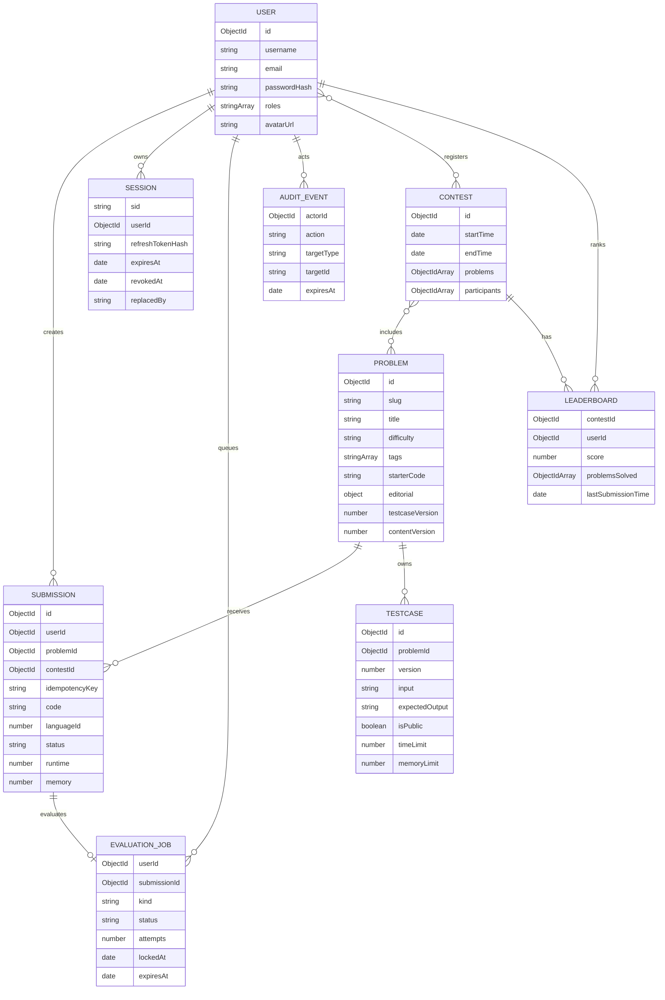

# Data model

`LearningTrack` separately stores slug, title, description, tags, ordered lesson
content, and display order.

## Implemented production indexes

Migrations create, without dropping unknown indexes:

- Submission `{ userId: 1, createdAt: -1 }`
- Submission `{ userId: 1, problemId: 1, createdAt: -1 }`
- Submission unique partial `{ userId: 1, idempotencyKey: 1 }`
- Submission `{ status: 1, userId: 1, problemId: 1 }`
- EvaluationJob claim/status, TTL, and unique submission indexes
- Session user/revocation and TTL indexes
- Testcase `{ problemId: 1, version: 1, isPublic: 1 }`
- Contest `{ startTime: 1, endTime: 1 }`
- Leaderboard unique `{ contestId: 1, userId: 1 }`

## Lifecycle rules required

- Problem deletion removes testcases; submission-retention/soft-delete policy
  still requires owner approval.
- Contest deletion removes leaderboard rows.
- User deletion cascades Sessions, jobs, submissions, leaderboard rows and
  registrations while retaining pseudonymizable audit evidence.
- Submission retention: define how long source, stdout/stderr, and metrics remain.
- Backups: encrypted automated backups plus regular restore drills.
- Migrations: `npm run migrate`; content/testcases publish by optimistic version
  switch and seeds are versioned/idempotent.
