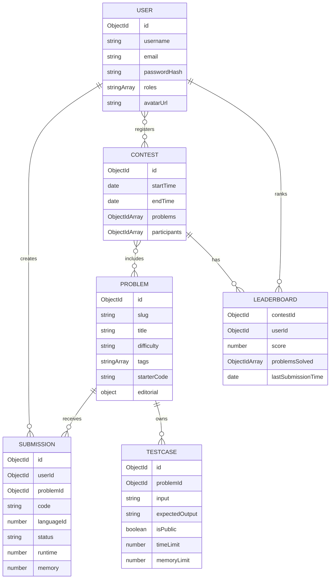

# Data model

`LearningTrack` separately stores slug, title, description, tags, ordered lesson
content, and display order.

## Required production indexes

In addition to unique user/problem slugs and the existing leaderboard sort
index, add and validate:

- Submission `{ userId: 1, createdAt: -1 }`
- Submission `{ userId: 1, problemId: 1, status: 1 }`
- Submission `{ problemId: 1, status: 1 }`
- Testcase `{ problemId: 1 }`
- Contest `{ startTime: 1, endTime: 1 }`
- Leaderboard unique `{ contestId: 1, userId: 1 }`

## Lifecycle rules required

- Problem deletion: remove/retain testcases and submissions according to a
  documented soft-delete policy.
- Contest deletion: remove leaderboard rows and registrations.
- User deletion: erase or pseudonymize PII and source code per policy.
- Submission retention: define how long source, stdout/stderr, and metrics remain.
- Backups: encrypted automated backups plus regular restore drills.
- Migrations: versioned, reversible, observed, and tested before deployment.
