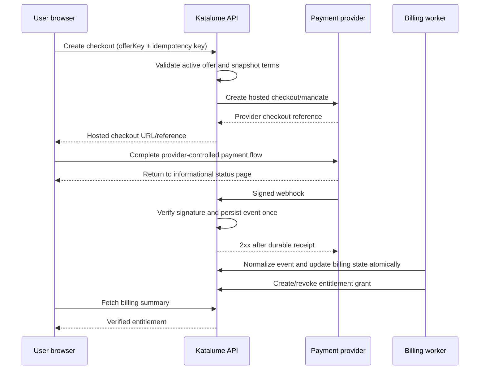

# Subscription readiness

**Status:** target-state design only  
**Runtime state:** disabled  
**Pricing state:** undecided  
**Payment provider state:** unselected

Katalume must not display checkout, collect payment details, create mandates, or
grant paid access from a client-side callback until every activation gate in
this document is closed. The public beta remains free.

## Design goals

- Support weekly, monthly, yearly, and lifetime offers in INR.
- Keep plan benefits and pricing independent from the payment provider.
- Make provider callbacks replay-safe, auditable, and recoverable.
- Grant access from Katalume's entitlement ledger, never from a browser claim.
- Allow an India-first provider now and a different or additional provider
  later without rewriting product authorization.
- Preserve a useful free tier and avoid locking learning history behind payment.

## Explicit non-goals for this phase

- No prices, discounts, trials, or paid feature limits are approved.
- No provider SDK, API key, webhook secret, checkout route, or billing UI is
  added to production.
- No payment-method data is stored by Katalume.
- No claim is made that lifetime access means the service must operate forever.
- This document is engineering readiness, not tax or legal advice.

## Commercial model boundary

The product catalog should describe offers without embedding provider IDs in
application code.

| Concept | Example values | Rule |
|---|---|---|
| Product tier | `free`, `plus` | Determines the entitlement set |
| Billing cadence | `weekly`, `monthly`, `yearly`, `lifetime` | Lifetime is a one-time purchase, not a recurring subscription |
| Price version | immutable integer | Existing purchases retain the price/version they accepted |
| Currency | `INR` initially | Store minor units; never use floating point |
| Offer status | `draft`, `active`, `retired` | Retiring an offer must not revoke valid access |
| Provider mapping | provider + external plan/offer ID | Configuration/data, not authorization logic |

Each purchasable offer should have a stable internal `offerKey`, such as
`plus_monthly_in_v1`. The displayed amount, tax treatment, benefits, and
provider mapping are immutable once a real purchase references the offer.
Create a new version to change them.

Weekly plans can improve affordability but usually create more renewals,
support load, mandate failures, and involuntary churn. Keep the cadence in the
model, but decide whether to launch it only after provider capability and
unit-economics review.

## Source-of-truth rules

1. The payment provider is the source of truth for money movement.
2. Katalume is the source of truth for product entitlements.
3. A signed webhook or an authenticated server-to-server reconciliation may
   change billing state.
4. A checkout success page is informational only. It must never unlock access.
5. Duplicate and out-of-order events are expected.
6. Provider downtime must not immediately remove already-paid access.
7. Manual support grants must be separate, attributed, expiring where
   appropriate, and auditable.

## Target data model

All identifiers below are internal opaque IDs unless prefixed with
`provider`.

### `BillingCustomer`

| Field | Purpose |
|---|---|
| `userId` | Unique Katalume user |
| `provider` | Adapter key, for example `razorpay` |
| `providerCustomerId` | Encrypted or access-restricted external reference |
| `billingEmail` | Invoice/contact address; separate from login changes |
| `taxProfile` | Optional legal name, country/state, postal code, GSTIN after validation |
| `createdAt`, `updatedAt` | Audit timestamps |

Unique index: `{ provider: 1, providerCustomerId: 1 }`. A user may have more
than one provider customer during migration, so do not make `userId` globally
unique without the provider dimension.

### `BillingOffer`

| Field | Purpose |
|---|---|
| `offerKey` | Stable public-safe internal key |
| `tier` | Entitlement tier |
| `cadence` | Weekly, monthly, yearly, or lifetime |
| `currency` | ISO currency, initially `INR` |
| `amountMinor` | Integer paise |
| `taxBehavior` | Inclusive, exclusive, or not applicable after professional review |
| `version` | Immutable commercial version |
| `benefitSetVersion` | Immutable entitlement definition |
| `providerMappings` | External plan/offer IDs by provider and environment |
| `status` | Draft, active, or retired |

Unique index: `{ offerKey: 1, version: 1 }`.

### `Subscription`

| Field | Purpose |
|---|---|
| `userId`, `billingCustomerId`, `offerId` | Ownership and accepted offer |
| `provider`, `providerSubscriptionId` | Reconciliation keys |
| `status` | Internal normalized state |
| `currentPeriodStart`, `currentPeriodEnd` | Access window |
| `cancelAtPeriodEnd`, `cancelledAt` | Cancellation semantics |
| `graceUntil` | Bounded recovery window |
| `latestProviderEventAt` | Out-of-order event protection |
| `version` | Optimistic concurrency |

Normalized states:

```text
pending -> active -> past_due -> active
                   -> grace -> expired
          active -> cancel_scheduled -> expired
pending -> failed
active|past_due|grace -> cancelled
```

Provider state strings must be retained in metadata for investigation but
translated through the adapter before product code sees them.

### `Purchase`

Lifetime access belongs in a separate one-time `Purchase` record. It contains
the accepted offer snapshot, provider order/payment IDs, amount/currency/tax
snapshot, status, captured/refunded timestamps, and reconciliation metadata.
The corresponding entitlement has no scheduled end but remains subject to the
published lifetime terms.

### `Payment` and `Refund`

Store provider references, internal owner, amount in minor units, currency,
normalized status, provider status, attempt number, failure category, captured
timestamp, and immutable offer/tax snapshots. Never store PAN, CVV, UPI PIN,
bank credentials, or a reusable mandate credential.

### `WebhookEvent`

| Field | Purpose |
|---|---|
| `provider`, `providerEventId` | Idempotency key |
| `payloadHash` | Detect conflicting replays |
| `signatureValid` | Verification result |
| `receivedAt`, `occurredAt` | Ordering and latency |
| `status` | Received, processing, processed, ignored, failed, dead-letter |
| `attempts`, `nextAttemptAt`, `lastErrorCode` | Retry control |
| `resourceRefs` | Redacted lookup IDs |

Unique index: `{ provider: 1, providerEventId: 1 }`.

Store the minimum payload needed for dispute and replay handling. Encrypt or
redact personal fields and apply a documented retention limit.

### `EntitlementGrant`

| Field | Purpose |
|---|---|
| `userId` | Access owner |
| `benefitSetVersion` | Immutable benefits |
| `sourceType`, `sourceId` | Subscription, purchase, promotion, support |
| `startsAt`, `endsAt` | Access interval; lifetime may have no `endsAt` |
| `status` | Scheduled, active, revoked, expired |
| `reason`, `actorId` | Manual action audit |

The effective entitlement is computed server-side from active grants. Cache it
briefly, invalidate on billing events, and fail to the last verified grant
during a short provider outage.

## Backend module boundary

Future billing code should live behind a provider-neutral boundary:

```text
src/billing/
  billing.service
  entitlement.service
  offer.repository
  webhook.service
  reconciliation.service
  providers/
    provider.interface
    razorpay.adapter
```

The adapter contract should cover:

```text
createCustomer
createCheckout
fetchSubscription
cancelSubscription
createRefund
verifyWebhook
normalizeWebhook
```

Controllers must not call a provider SDK directly. Provider objects must not
leak into user or authorization models.

## Planned API surface

All mutating endpoints require an authenticated user, CSRF protection where
applicable, distributed rate limits, and an idempotency key.

| Method and route | Purpose |
|---|---|
| `GET /api/billing/offers` | Return active, server-approved offer snapshots |
| `GET /api/billing/summary` | Return the user's normalized billing and entitlement state |
| `POST /api/billing/checkouts` | Create a provider-hosted checkout/mandate flow |
| `POST /api/billing/subscriptions/:id/cancel` | Cancel now or at period end |
| `POST /api/billing/subscriptions/:id/resume` | Resume if the provider permits it |
| `POST /api/billing/webhooks/:provider` | Receive signed provider events; no user auth |
| `POST /api/admin/billing/reconcile/:id` | Restricted, audited repair |

The frontend should learn access through `/api/billing/summary`; it must not
infer paid status from query parameters, local storage, or a provider response.

## Checkout and webhook sequence



Webhook processing rules:

1. Read the raw request body with a strict size limit.
2. Select the secret by provider and environment; verify before JSON-driven
   side effects.
3. Persist the unique event and payload hash before acknowledging it.
4. Return success for an identical replay.
5. Process asynchronously with bounded retries and dead-letter alerting.
6. Lock the billing aggregate and reject stale state transitions using provider
   occurrence time plus provider sequence/version when available.
7. Apply billing state, payment state, and entitlement changes in one database
   transaction where supported.
8. Reconcile uncertain events against the provider API.

## India-first payment requirements

The initial experience should:

- use INR and integer paise;
- prefer a provider-hosted checkout to minimize payment-data scope;
- support UPI AutoPay where the chosen provider and merchant account permit it,
  with cards/e-mandate as evaluated fallbacks;
- explain mandate frequency, amount, start/end, cancellation, and any trial
  before authorization;
- expect customer pause/revoke/cancel actions outside Katalume and consume the
  corresponding webhook;
- show renewal date, final payable amount, tax treatment, invoice access, and
  cancellation behavior in plain language;
- support pre-debit notifications and provider-required additional
  authentication without representing a pending debit as paid.

NPCI documents customer controls including modify, revoke, pause, and unpause,
as well as pre-debit notification at least 24 hours before execution for the
covered AutoPay flow. Provider capabilities and thresholds change, so verify
them during activation rather than hard-coding them.

Before accepting money, the owner must obtain professional decisions on GST
registration, place of supply, invoice fields/numbering, tax-inclusive display,
refund/cancellation terms, consumer disclosures, accounting, and e-invoicing
applicability. Store the tax decision and invoice snapshot used for each
transaction; do not recompute old invoices from current settings.

## Security and privacy controls

- Separate live and test provider accounts, IDs, webhook URLs, and secrets.
- Keep secrets only in the backend secret manager; never use `NEXT_PUBLIC_*`.
- Rotate webhook/API secrets and support overlapping verification during
  rotation.
- Restrict billing admin actions with MFA, least privilege, reason capture, and
  immutable audit events.
- Use constant-time signature comparison where the provider library does not.
- Enforce server-side offer lookup; reject client-supplied amounts, currency,
  tier, tax, or provider plan IDs.
- Bind checkout ownership to the authenticated Katalume user.
- Tokenize through the provider and keep Katalume out of raw card/UPI data.
- Redact provider payloads, email, phone, GSTIN, addresses, and failure detail
  from ordinary logs and error reporting.
- Rate-limit checkout creation, status polling, cancellation, refunds, and
  webhook failures independently.
- Reconcile captured payments with settlements and alert on money/access
  disagreement.

## Feature flags and configuration

The safe default in every environment is off:

```text
BILLING_ENABLED=false
CHECKOUT_ENABLED=false
BILLING_PROVIDER=disabled
BILLING_WEBHOOK_PROCESSING_ENABLED=false
PAID_ENTITLEMENTS_ENFORCED=false
```

Activation must be staged. Enabling checkout must not automatically enforce
paid entitlements, and enabling entitlement enforcement must not expose
checkout. Unknown or missing configuration fails closed for new purchases while
preserving already-verified access.

Provider-specific configuration is added only after selection:

```text
BILLING_<PROVIDER>_KEY_ID
BILLING_<PROVIDER>_KEY_SECRET
BILLING_<PROVIDER>_WEBHOOK_SECRET
BILLING_<PROVIDER>_ACCOUNT_ID
```

Do not create these variables or placeholder secrets in production yet.

## Testing strategy

### Unit and contract tests

- money/currency parsing and immutable offer snapshots;
- every normalized state transition, including invalid and out-of-order events;
- entitlement overlap, expiry, refund, cancellation, grace, and lifetime cases;
- provider adapter contract against captured, sanitized fixtures;
- signature verification, tampered payloads, duplicate IDs, and conflicting
  replays;
- authorization and ownership checks for every route.

### Integration and failure tests

- checkout request retry with one idempotency key;
- duplicate/out-of-order webhook delivery;
- event persisted but worker interrupted before state update;
- provider timeout after an unknown checkout result;
- successful payment with delayed webhook;
- failed renewal, recovery, cancellation, refund, chargeback, and dispute;
- database transaction failure at each write boundary;
- secret rotation and test/live environment isolation.

### Production-like proof

Use provider test mode plus a dedicated staging deployment. Rehearse
reconciliation, rollback, support lookup, invoice generation, data
export/deletion, and webhook replay. Run a low-value owner-only live transaction
and refund only after legal, tax, and launch approval.

## Observability and operations

Measure checkout creation/error rate, webhook verification failures, processing
lag, dead letters, payment success by method, renewal recovery, entitlement
update latency, refunds/disputes, and reconciliation drift. Never use raw
payment identifiers or personal data as metric labels.

Alerts should cover:

- any captured payment without a matching entitlement after the target window;
- any entitlement with a refunded/reversed source;
- rising signature failures or webhook backlog;
- test events/secrets reaching production or the reverse;
- settlement mismatch and repeated reconciliation failure.

Provide runbooks for provider outage, webhook outage, payment-without-access,
access-without-payment, cancellation, refund, dispute, account merge, secret
rotation, and provider migration.

## Provider migration

Because Katalume owns offers and entitlements, a migration can:

1. stop new checkouts on provider A;
2. keep consuming A's renewals and webhooks;
3. create new customers/subscriptions on provider B;
4. map both providers into the same normalized ledger;
5. invite existing users to authorize a new mandate where portability is not
   available;
6. retire A only after refunds, disputes, reconciliation, and retention close.

Never overwrite provider A identifiers with provider B identifiers.

## Activation gates

- [ ] Free-versus-paid benefits approved from user research
- [ ] Weekly/monthly/yearly/lifetime prices and tax display approved
- [ ] Lifetime terms and business liability approved
- [ ] Provider selected after capability, onboarding, support, and total-cost review
- [ ] Legal entity, bank/settlement, KYC, GST, invoices, terms, privacy, refunds, and cancellation approved
- [ ] Backend models, adapter, APIs, workers, migrations, and indexes implemented
- [ ] Frontend pricing, checkout, manage-billing, invoice, and recovery UX implemented
- [ ] Webhook signature, idempotency, ordering, retry, and reconciliation tests green
- [ ] Test/live secrets and environments isolated
- [ ] Support and finance runbooks rehearsed
- [ ] Accessibility, mobile, localization, analytics-consent, and security review passed
- [ ] Staged test-mode and owner-only live canary passed
- [ ] `BILLING_ENABLED` separately approved for production

Until every applicable gate is closed, Katalume remains free and all billing
flags remain false.

## Current references

- [NPCI: UPI AutoPay](https://www.npci.org.in/product/autopay)
- [Reserve Bank of India: e-mandate framework index/circular](https://www.rbi.org.in/scripts/bs_circularindexdisplay.aspx/Scripts/BS_CircularIndexDisplay.aspx?Id=12722)
- [Razorpay: subscription webhook events](https://razorpay.com/docs/payments/subscriptions/subscribe-to-webhooks/)
- [Razorpay: webhook processing overview](https://razorpay.com/docs/webhooks/)
- [GST portal: e-invoicing glossary](https://tutorial.gst.gov.in/downloads/news/pamphlet_e_invoicing_glossary_updated_17_08_2023_approved_final.pdf)

These links are implementation inputs, not permanent constants. Re-check them
and the chosen provider's current merchant capabilities immediately before
activation.
