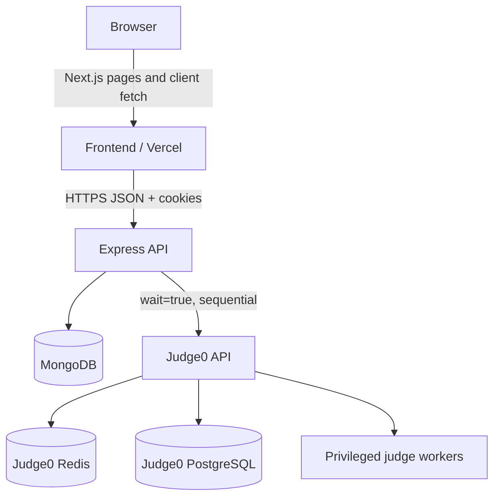
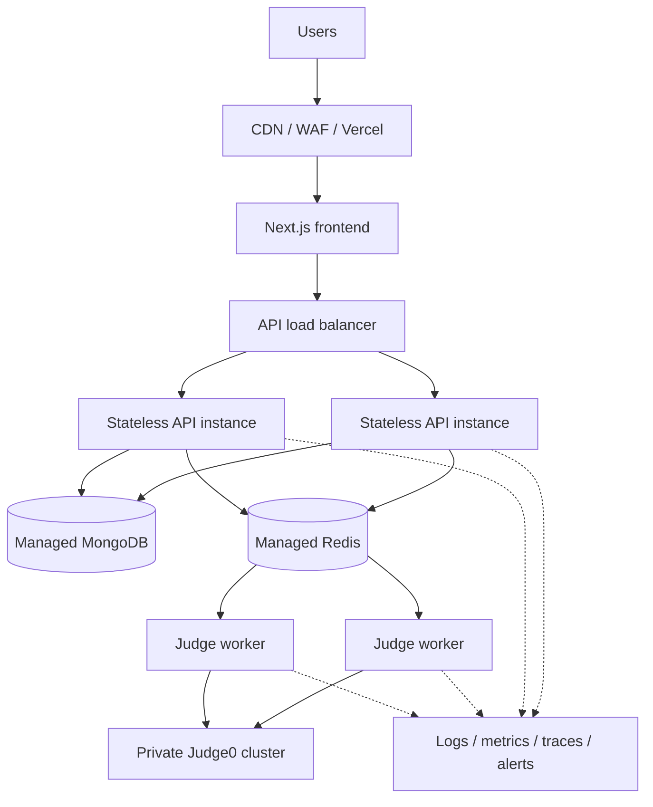

# System architecture

## Current implementation

The frontend can operate in `mock`, `live`, or `auto` mode. Production must use
`live` with mock fallback disabled.

## Target production architecture

## Trust boundaries

1. **Public edge:** browsers and untrusted network traffic.
2. **Application:** Vercel and public API; validates identity and input.
3. **Data:** MongoDB and session/queue Redis; private network only.
4. **Execution:** Judge0 and privileged workers; highest-risk boundary because
   they execute adversarial user code.
5. **Operations:** CI/CD, secrets, logs, metrics, and administrative access.

Judge0 must be isolated from application/data hosts, unauthenticated public
access must be impossible, and worker egress should be denied unless explicitly
required.

## Request flows

### Authentication

1. Browser posts credentials to API.
2. API returns a short-lived bearer token and writes a signed httpOnly refresh
   cookie.
3. Frontend uses the bearer token for API requests.
4. Next.js `src/proxy.ts` validates protected navigation with `/auth/session`.
5. Reload calls `/auth/session`, then `/auth/refresh` for a new bearer token.

### Submission — current

1. API validates language and source size.
2. API writes a Pending Submission.
3. API loads hidden tests.
4. API executes each test synchronously through Judge0.
5. API writes the final verdict and returns the Submission.

### Submission — target

1. API validates, creates an idempotent Pending record, and enqueues a job.
2. API returns `202` and the submission ID.
3. Worker claims the job, applies resource policy, executes through Judge0, and
   atomically finalizes the record.
4. Frontend polls or receives a status event.
5. Retries, dead-letter handling, and reconciliation recover interrupted work.
