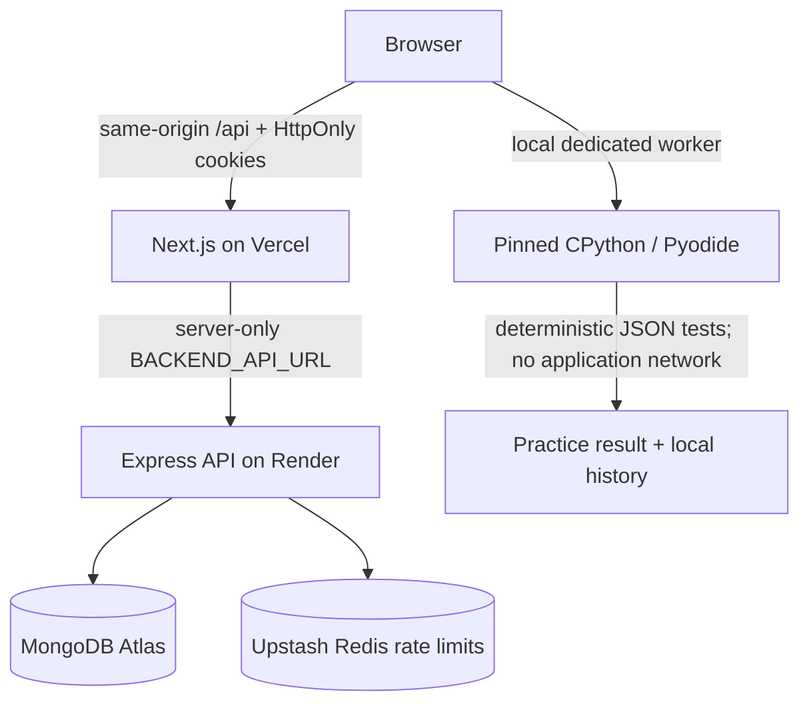
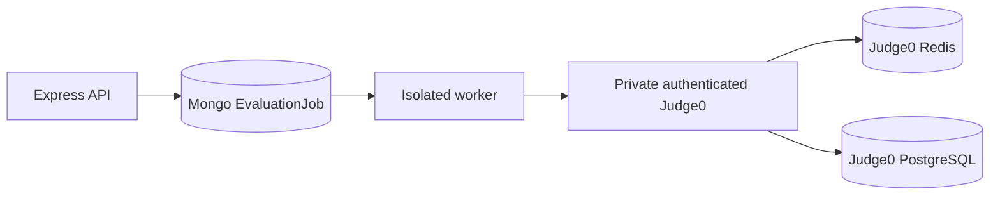

# System architecture

## Public free-beta architecture

Production is fail-closed: live adapter, no mock fallback, HTTPS site/backend
URLs, and a server-only backend origin. The frontend serves the pinned Python
runtime and Monaco assets locally; it does not depend on an editor/runtime CDN.

## Trust boundaries

1. **Public edge:** browser, Vercel, and the same-origin BFF.
2. **BFF:** forwards only allow-listed headers, handles backend redirects
   manually, and keeps authentication cookies on the public origin.
3. **Application:** Express validates sessions, input, roles, ownership, quotas,
   and content access.
4. **Data:** Atlas requires a database user plus narrow IP access; Upstash uses
   TLS credentials.
5. **Practice execution:** a disposable Web Worker runs CPython/WASM with source
   size and time limits. Network primitives are removed after runtime loading.
6. **Server execution:** API run/submit routes reject requests while
   `EXECUTION_MODE=disabled`.

Browser isolation is suitable for a practice beta, not adversarial ranked
judging. A user controls their browser and can inspect client-delivered tests.

## Authentication flow

1. Browser posts email credentials or starts Google OAuth through same-origin
   `/api/auth/*`.
2. Next.js forwards server-to-server and preserves backend redirects and
   `Set-Cookie` headers.
3. Express creates a hashed, tracked Session and issues `katalume_access` and
   rotating `katalume_session` HttpOnly cookies.
4. Browser-readable access tokens are not returned or persisted in production.
5. Refresh rotates the session; detected reuse revokes the user's sessions.

## Practice evaluation flow

1. The live API supplies problem content plus the active versioned browser
   practice suite. Mock development continues using the bundled frontend
   catalog.
2. Run evaluates public samples. Submit evaluates every client-delivered
   practice case for the problem.
3. A disposable worker loads pinned CPython, imports the user's `solve(payload)`,
   executes JSON cases, and applies tolerant numeric comparison.
4. The UI stores accepted history and progress locally and labels the result
   source `browser`.

## Future durable evaluation

The backend already contains atomic claims, leases, retries, dead letters,
bounded polling/concurrency, and verdict mapping. This path remains off until
isolated infrastructure, monitoring, capacity, and recovery are proven.
