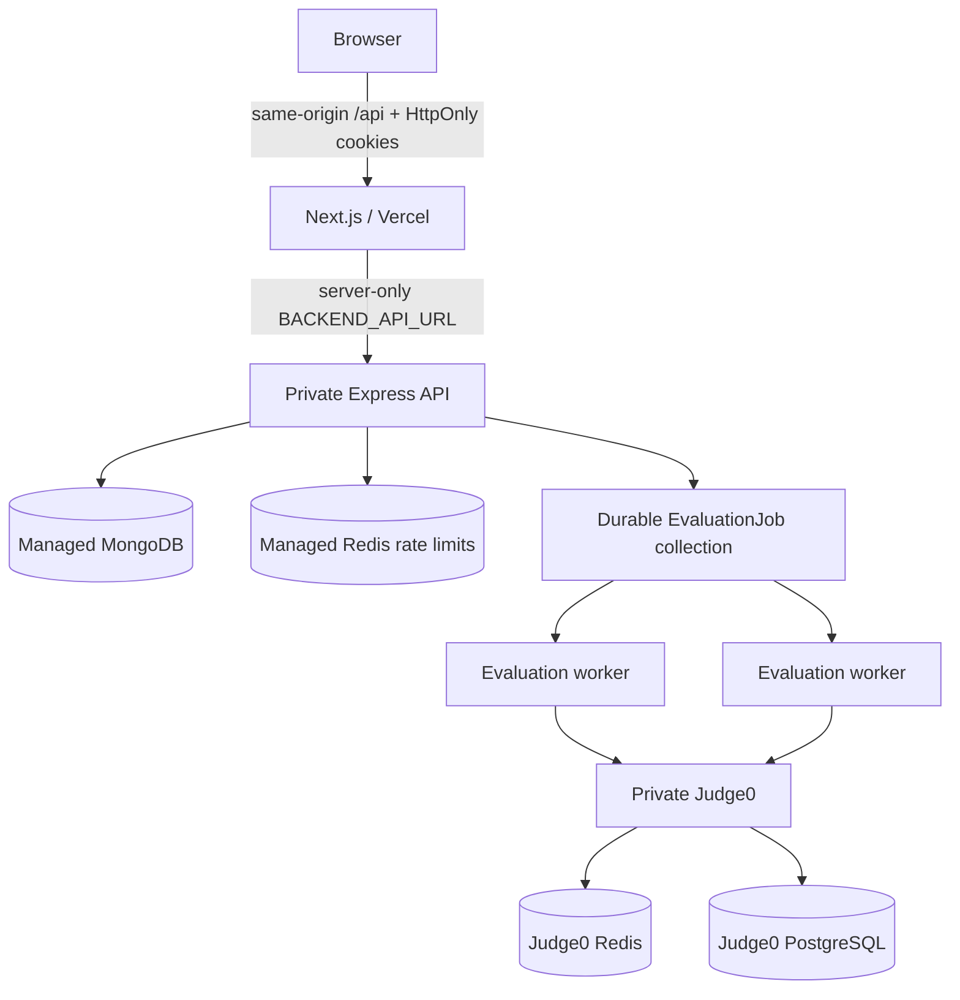

# System architecture

## Implemented architecture

The frontend retains deterministic `mock` mode for local UI tests. Production
is fail-closed: `live` mode, no mock fallback, HTTPS site/backend URLs, and a
server-only backend origin are required by the Vercel production build.

## Trust boundaries

1. **Public edge:** browser, CDN/WAF, and Next.js application.
2. **BFF boundary:** the generic `/api` route enforces same-origin mutations,
   forwards only allow-listed headers, and keeps the backend origin private.
3. **Application:** Express validates identity, session state, input, ownership,
   roles, quotas, and idempotency.
4. **Data:** MongoDB and distributed-rate-limit Redis are private.
5. **Execution:** separate workers and authenticated Judge0 execute adversarial
   code with CPU, memory, wall-time, file-size, language, and payload limits.
6. **Operations:** public repositories, CI/CD, secrets, audit events, logs,
   metrics, alerts, backups, and administrative access.

## Authentication flow

1. Browser posts credentials to same-origin `/api/auth/login` or `/signup`.
2. Next.js forwards server-to-server to Express.
3. Express creates a hashed, tracked Session and sets short-lived
   `katalume_access` plus rotating `katalume_session` HttpOnly cookies.
4. Browser-readable access tokens are not returned in production or persisted.
5. Every API authorization verifies the access JWT and live Session record.
6. Refresh rotates the session; reuse revokes all active sessions for the user.

## Evaluation flow

1. API validates source/language, problem/contest eligibility, and an optional
   `Idempotency-Key`.
2. It creates a `Queued` Submission plus durable EvaluationJob and returns `202`.
3. A worker atomically claims the job, heartbeats its lease, and marks the
   Submission `Processing`.
4. Judge0 submissions use `wait=false`; the worker polls with bounded timeouts
   and bounded testcase concurrency while propagating testcase resource limits.
5. The worker finalizes the verdict and contest score, or retries with backoff
   before moving exhausted jobs to `dead-letter`.
6. The frontend polls the owner-scoped submission/job resource.

## Remaining deployment topology

Production must still provision managed MongoDB and Redis, private Judge0 and
its stores, API/worker replicas, immutable images, centralized telemetry,
backups, alerting, and tested rollback. Judge0 must not be publicly reachable or
share a host/network trust zone with application data.
