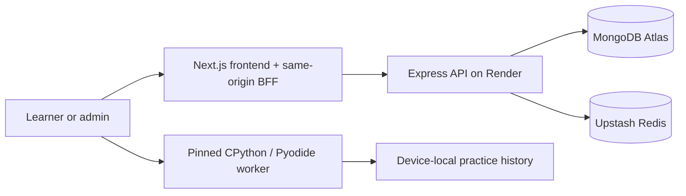

# Katalume documentation

**Practice machine learning into mastery.**

Katalume is the training ground for machine learning — solve real ML problems
in an in-browser judge, compete in contests, and climb to mastery. LeetCode
rigor meets Kaggle depth.

The name combines **kata**, deliberate practice that forges mastery, with
**lume**, light or illumination—the moment a hard problem clicks.

!!! info "Launch status — 2026-07-16"
    Katalume is live as a **zero-cost public practice beta** at
    [katalume.vercel.app](https://katalume.vercel.app). Browser practice is live;
    ranked contests and server execution remain disabled until isolated paid
    judging, monitoring, capacity, and recovery evidence are complete. See
    [Production readiness](launch/readiness.md).

## Where to begin

| Audience | Start here |
|---|---|
| Product and leadership | [Product overview](product/overview.md) and [July 20 plan](launch/july-20-plan.md) |
| Frontend engineer | [Frontend architecture](architecture/frontend.md) |
| Backend engineer | [Backend architecture](architecture/backend.md) and [API reference](api/reference.md) |
| Platform/SRE | [Deployment](operations/deployment.md), [Observability](operations/observability.md), and [Runbooks](operations/runbooks.md) |
| Security reviewer | [Security](operations/security.md) and [Production readiness](launch/readiness.md) |
| Contributor | [Local development](guides/local-development.md) and [Testing](guides/testing.md) |

## System at a glance

Solid paths describe the live free-beta flow. Durable evaluation workers and a
private Judge0 remain the future server-submit path.

## Current repositories

| Repository | Purpose | Canonical branch/state |
|---|---|---|
| `frontend` | Next.js product, browser Python, and same-origin BFF | Public; PR 40 merged to `develop`, PR 41 synced to `main` |
| `backend-api` | Express/Mongo API and future evaluation worker/Judge0 path | Public; catalog PR 28 merged to `main` |
| `documentation` | This source of truth | `main` |

All six organization repositories are public.
