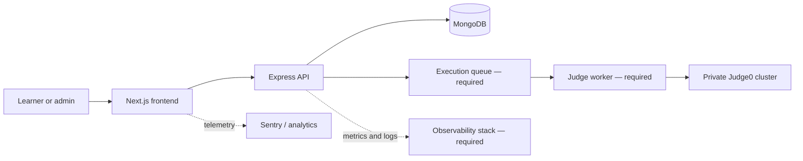

# MLBoost documentation

MLBoost is a browser-based platform for practicing machine-learning and
data-science problems: **LeetCode rigor with Kaggle depth**.

Users solve problems in an in-browser editor, run code against custom input,
submit against hidden tests, follow curated learning tracks, join competitions,
and measure progress. Administrators manage problems, contests, and learning
tracks inside the product.

!!! warning "Launch status — 2026-07-13"
    The product UI and mock experience are strong, but MLBoost is **not yet ready
    for unrestricted public production traffic**. The frontend production
    deployment currently has no live environment variables, no backend
    production deployment is recorded, and the execution/auth/contest systems
    have P0 launch work. See [Production readiness](launch/readiness.md).

## Where to begin

| Audience | Start here |
|---|---|
| Product and leadership | [Product overview](product/overview.md) and [July 20 plan](launch/july-20-plan.md) |
| Frontend engineer | [Frontend architecture](architecture/frontend.md) |
| Backend engineer | [Backend architecture](architecture/backend.md) and [API reference](api/reference.md) |
| Platform/SRE | [Deployment](operations/deployment.md), [Observability](operations/observability.md), and [Runbooks](operations/runbooks.md) |
| Security reviewer | [Security](operations/security.md) and [Production readiness](launch/readiness.md) |
| Contributor | [Local development](guides/local-development.md) and [Testing](guides/testing.md) |

## System at a glance

Solid paths describe implemented request flows. Components marked “required”
represent the target production architecture; current judging is synchronous.

## Current repositories

| Repository | Purpose | Canonical branch/state |
|---|---|---|
| `frontend` | Next.js product | `develop` at `ccd6503`; logo PR #30 merged |
| `backend-api` | Express/Mongo/Judge0 API | `main` at `d144514` |
| `documentation` | This source of truth | `main` |

Frontend `main` remains one logo commit behind `develop` as of this snapshot.
