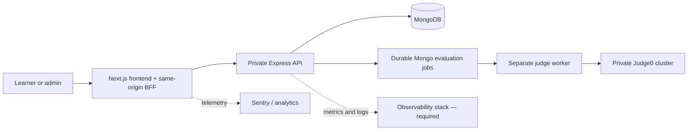

# Katalume documentation

**Practice machine learning into mastery.**

Katalume is the training ground for machine learning — solve real ML problems
in an in-browser judge, compete in contests, and climb to mastery. LeetCode
rigor meets Kaggle depth.

The name combines **kata**, deliberate practice that forges mastery, with
**lume**, light or illumination—the moment a hard problem clicks.

!!! warning "Launch status — 2026-07-13"
    The application-side P0 architecture is implemented and container-verified,
    but Katalume is **not yet ready for unrestricted production traffic** until
    managed infrastructure, production secrets/configuration, restore/load
    drills, monitoring, and release approvals are completed. See
    [Production readiness](launch/readiness.md).

## Where to begin

| Audience | Start here |
|---|---|
| Product and leadership | [Product overview](product/overview.md) and [July 20 plan](launch/july-20-plan.md) |
| Frontend engineer | [Frontend architecture](architecture/frontend.md) |
| Backend engineer | [Backend architecture](architecture/backend.md) and [API reference](api/reference.md) |
| Platform/SRE | [Deployment](operations/deployment.md), [Observability](operations/observability.md), and [Runbooks](operations/runbooks.md) |
| Security reviewer | [Security](operations/security.md) and [Production readiness](launch/readiness.md) |
| Contributor | [Local development](guides/local-development.md) and [Testing](guides/testing.md) |

## System at a glance

Solid paths describe the implemented, locally container-verified request flow.
Production hosting and observability remain deployment gates.

## Current repositories

| Repository | Purpose | Canonical branch/state |
|---|---|---|
| `frontend` | Next.js product and same-origin BFF | Public; hardening merged to `develop` and synced to `main` |
| `backend-api` | Express/Mongo/evaluation worker/Judge0 API | Public; hardening merged to `main` |
| `documentation` | This source of truth | `main` |

All six organization repositories are public as of 2026-07-13.
