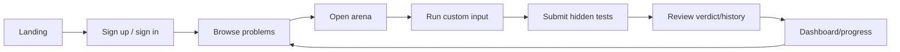

# User journeys

## Learner journey

### Expected behavior

- Authentication creates a signed httpOnly refresh/session cookie in live mode.
- Protected navigation is checked by `src/proxy.ts` against the backend session.
- Problem list state is annotated per user as unsolved, attempted, or solved.
- Run should execute without saving a submission; submit persists the result.
- Accepted submissions update progress and solved state.

!!! danger "Known live-contract defect"
    Frontend Run currently targets `/api/submissions/run`, while the backend
    exposes `/api/runner/run`. This must be repaired before live launch.

## Administrator journey

1. Provision an Admin role with the backend seed script.
2. Sign in through the normal product flow.
3. Open `/admin`.
4. Create or manage problems, contests, and learning tracks.
5. Validate content in staging before publishing to production.

Production administration still needs audit logs, stronger MFA/session controls,
content lifecycle states, and approval/rollback behavior.

## Contest journey

1. Browse competition cards.
2. Open contest details and review the problem set.
3. Sign in and register.
4. Submit solutions during the contest window.
5. Review standings.

The UI exists, but production contest attribution and scoring are incomplete:
submissions do not carry a contest ID and the active submission path does not
populate leaderboard records.
