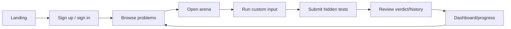

# User journeys

## Learner journey

### Expected behavior

- Authentication creates tracked Secure/HttpOnly access and refresh cookies.
- Protected navigation is checked server-to-server by `src/proxy.ts`.
- Problem list state is annotated per user as unsolved, attempted, or solved.
- Run queues an ephemeral owner-scoped job; submit queues a durable Submission.
- Accepted submissions update progress and solved state.

The live client uses `/runner/run`, then polls `/runner/jobs/:id`; submissions
use an idempotency key and poll `/submissions/:id`.

## Administrator journey

1. Provision an Admin role with the backend seed script.
2. Sign in through the normal product flow.
3. Open `/admin`.
4. Create or manage problems, contests, and learning tracks.
5. Validate content in staging before publishing to production.

Admin writes create one-year audit events. Mandatory Admin MFA and formal
content approval/rollback remain production owner gates.

## Contest journey

1. Browse competition cards.
2. Open contest details and review the problem set.
3. Sign in and register.
4. Submit solutions during the contest window.
5. Review standings.

Contest links carry contest context into submissions. The API enforces active
window, registration and problem membership; first Accepted solves update one
unique leaderboard row idempotently.
